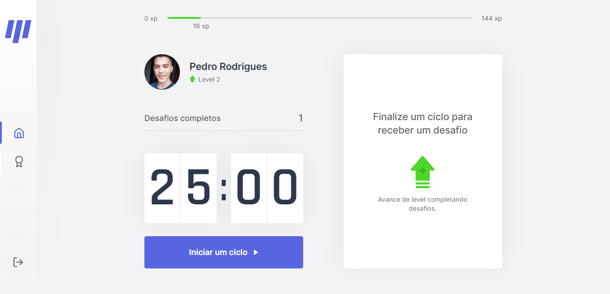
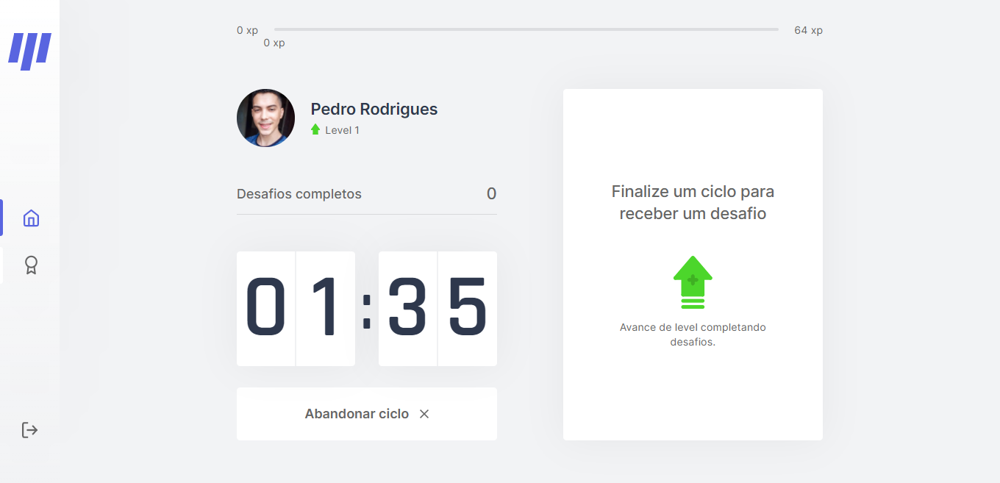
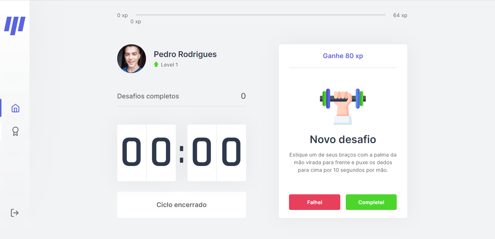
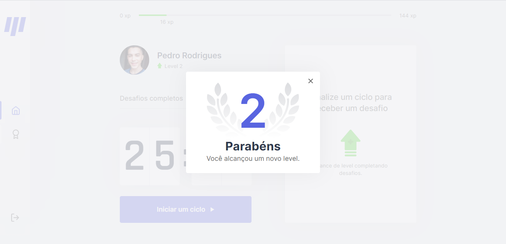

<h1 align="center">Move.it #NLW4</h1>
<p align="center">Project developed during Rocketseat's Next Level Week.</p>

<p align="center">
   <a href="#objective">Objective</a> • 
   <a href="#technologies">Technologies</a> •  
   <a href="#usage">Usage</a> •  
   <a href="#author">Author</a> •
   <a href="#license">License</a>
</p>

<h4 align="center"> 
	🚧  Move.it 🚀 Improving...  🚧
</h4>

<h1 align="center">
  
  
  
  
  
</h1>

<h3 id="objective"> Objective </h3>

Be more productive and healthy with the help of <a href="https://nlw-move-it-pedrojrodrigues.vercel.app/">Move.it</a> to manage your study and work period.

<h3 id="technologies"> Technologies </h3>

The following tools were used in the construction of the project:

- [ReactJS](https://pt-br.reactjs.org/)
- [Node.js](https://nodejs.org/en/)
- [NextJS](https://nextjs.org/)
- [Yarn](https://yarnpkg.com/)
- [TypeScript](https://www.typescriptlang.org/)
- [VSCode](https://code.visualstudio.com/)

<h3 id="usage" > Usage </h3>

Required: git, node and yarn (or npm).

```bash
# Clone Repository
$ git clone <https://github.com/pedrojrodrigues/NLW-move.it>

# Go to server folder
$ cd moveit-next

# Install Dependencies
$ yarn

# Run Application
$ yarn dev

# Access localhost - <http://localhost:3000>  
```      

<h3 id="author"> Author </h3>

<a href="https://github.com/pedrojrodrigues">
 
 <br />
 <sub><b>Pedro Rodrigues</b></sub></a> <a href="https://github.com/pedrojrodrigues">🚀</a>
 <br />


👋🏽 Contact me!

[](https://www.linkedin.com/in/pedro-j%C3%A2nio-rodrigues-abreu-3a3647176/) 
[](mailto:pedro.roguea@gmail.com)    

<h2 id="license"> 📝 License </h2>

This project is under the MIT license.